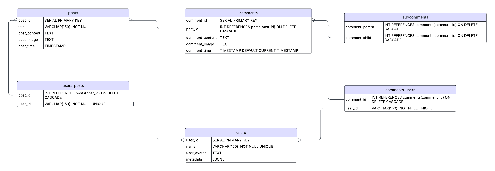

# 🧠 1337b04rd – Anonymous Imageboard / Анонимная имиджборда

## 🇺🇸 English Version

### Overview

**1337b04rd** is a minimalist yet functional imageboard built with **Go**, **PostgreSQL**, and **MinIO**, **Redis**. Inspired by early forums, it enables users to create threads, comment, and upload images — all anonymously.

---

### Features

- 💬 Thread and comment system
- 🖼 Image attachments (stored via MinIO/S3)
- 🧑‍🚀 Avatars and usernames from Rick and Morty API
- 🕐 Auto-deletion of inactive threads (10–15 mins)
- 📦 Hexagonal Architecture
- 🔐 Cookie-based session management
- 🧪 Unit tests (min. 20% coverage)

---

### Project Structure

```
📂 Root
 ├── 📂 internal # Core application logic.
 │   ├── 📂 governor # Business logic and core services (use cases, post/comment logic).
 │   ├── 📂 postgres # Database interaction layer (PostgreSQL implementation).
 │   ├── 📂 rest # HTTP handlers and routing for REST API endpoints.
 │   ├── 📂 config # Configuration loading (env, ports, DB/S3 credentials).
 │   ├── 📂 constants # Global constants used throughout the project.
 │   ├── 📂 minio_storage # MinIO/S3 image uploading, downloading, and bucket interaction logic.
 │   ├── 📂 redis # Redis integration for caching and temporary session storage.
 │   ├── 📂 rick_morty_rest # REST client for interacting with the Rick and Morty API.
 │   ├── 📂 types # Shared types and data structures used across layers.
 ├── 📂 cmd # Entry point for launching the application (main package with main.go).
 ├── 📂 frontend # Static files and HTML templates for the UI (catalog, post view, archive, etc.).
 ├── 📄 Dockerfile # Instructions to build a Docker image for the application.
 ├── 📄 docker-compose.yml #  Docker Compose configuration to run PostgreSQL, MinIO, and the Go application together.
```

---

## Database Schema

### Entity-Relationship Diagram



### Templates

- `catalog.html` – Shows active threads
- `archive.html` – Shows deleted/archived threads
- `post.html` – Thread with comment section
- `archive-post.html` – Read-only expired threads
- `create-post.html` – Form to create a new thread
- `error.html` – Error screen with back link

---

### Setup

1. create env file
2. I will send the link
3.

```bash
make up
```

4. then go to
   `http://localhost:<port>/catalog`
   the port is in the env file

# 🧠 1337b04rd – Анонимная имиджборда

## Русская версия

### Обзор

**1337b04rd** — минималистичная, но функциональная имиджборда, построенная на **Go**, **PostgreSQL**, **MinIO** и **Redis**. Вдохновлённая старыми форумами, она позволяет создавать треды, комментировать и загружать изображения — полностью анонимно.

---

### Возможности

- 💬 Система тредов и комментариев
- 🖼 Прикрепление изображений (хранение через MinIO/S3)
- 🧑‍🚀 Аватары и имена пользователей из Rick and Morty API
- 🕐 Автоудаление неактивных тредов (10–15 минут)
- 📦 Гексагональная архитектура
- 🔐 Управление сессиями через cookie
- 🧪 Юнит-тесты (покрытие минимум 20%)

---

### Структура проекта

```
📂 Корень проекта
├── 📂 internal             # Основная логика приложения
│   ├── 📂 governor         # Бизнес-логика (треды, комментарии)
│   ├── 📂 postgres         # Слой работы с базой данных PostgreSQL
│   ├── 📂 rest             # HTTP-обработчики и маршруты
│   ├── 📂 config           # Загрузка конфигурации (env, порты, доступы)
│   ├── 📂 constants        # Глобальные константы проекта
│   ├── 📂 minio_storage    # Работа с изображениями через MinIO/S3
│   ├── 📂 redis            # Интеграция с Redis
│   ├── 📂 rick_morty_rest  # REST-клиент для Rick and Morty API
│   ├── 📂 types            # Общие структуры данных
├── 📂 cmd                  # Точка входа (main.go)
├── 📂 frontend             # Статика и HTML-шаблоны (catalog, post, archive и др.)
├── 📄 Dockerfile           # Инструкции для сборки Docker-образа
├── 📄 docker-compose.yml  # Конфигурация Docker Compose (Go + PostgreSQL + MinIO)
```

---

## Схема базы данных

### ER-диаграмма

 (1).png)

---

### HTML-шаблоны

- `catalog.html` – Отображает активные треды
- `archive.html` – Отображает удалённые/архивные треды
- `post.html` – Полный тред с комментариями
- `archive-post.html` – Просмотр только удалённых тредов (только чтение)
- `create-post.html` – Форма создания нового треда
- `error.html` – Страница ошибок с кнопкой «Назад»

---

### Установка

1. Создайте `.env` файл
2. Я вышлю тебе ссылку
3. Запустите проект:

```bash
make up
```

4. Перейдите по адресу:  
   `http://localhost:<порт>/catalog`  
   Порт указывается в env-файле
